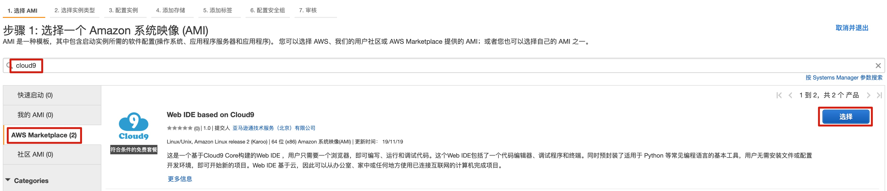
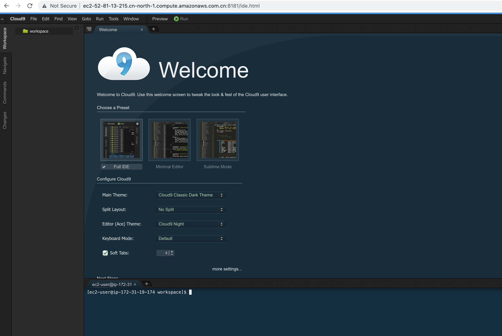
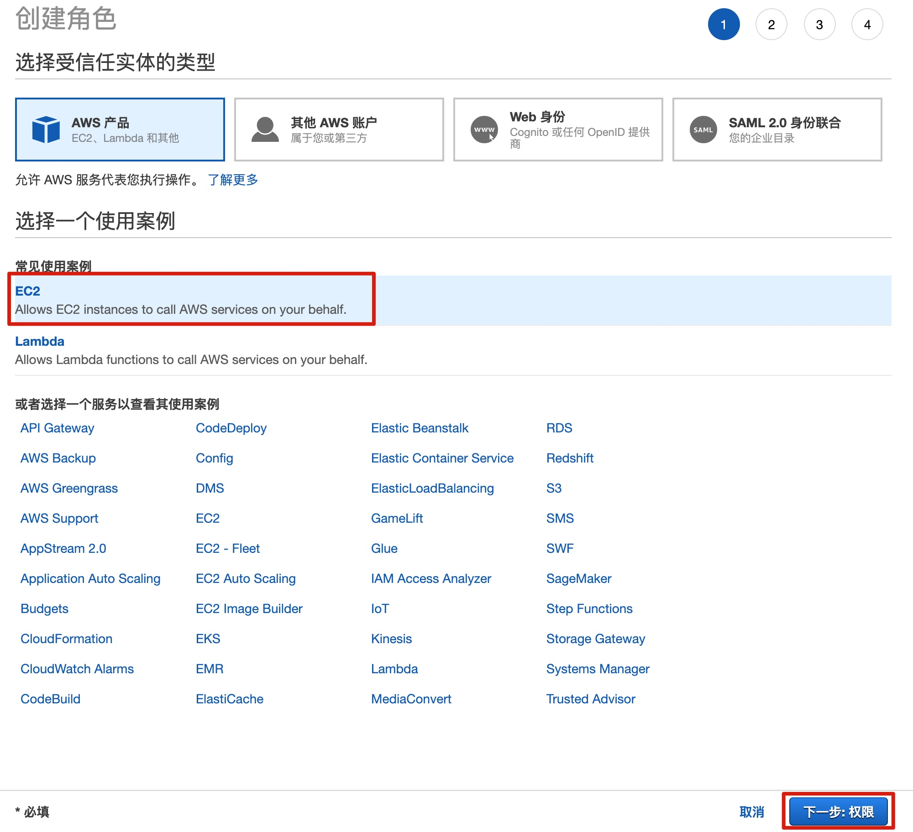
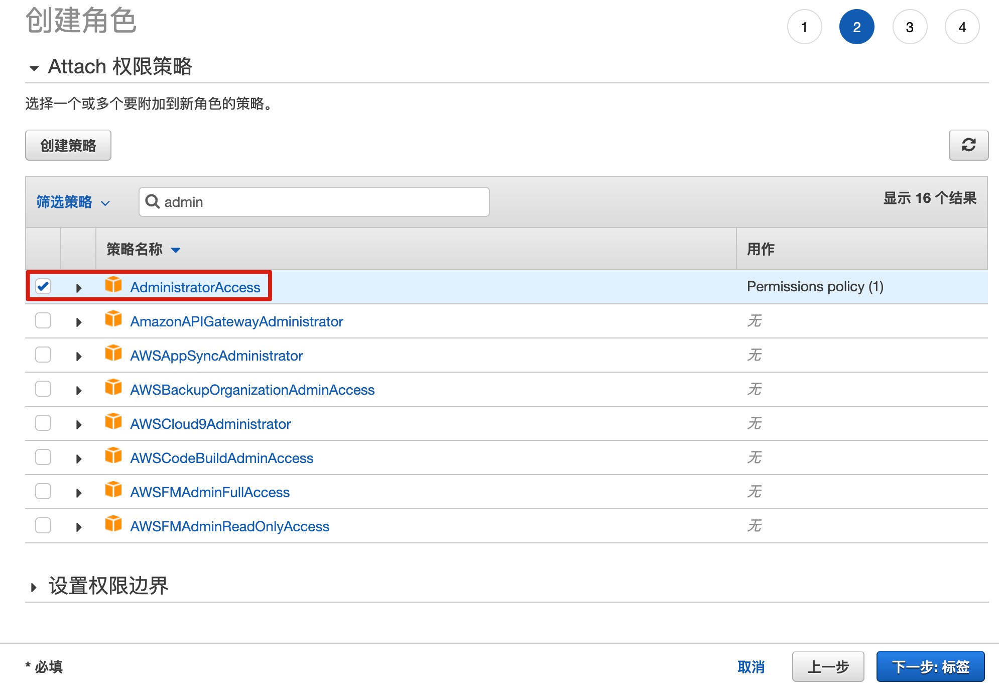
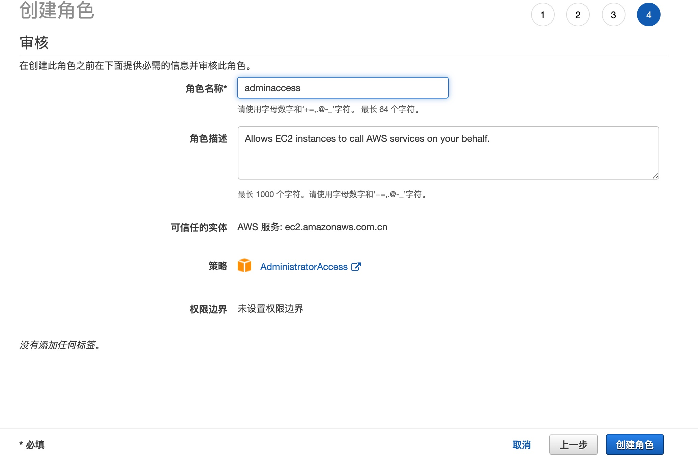
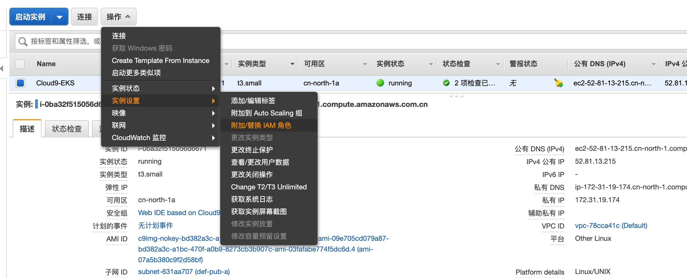
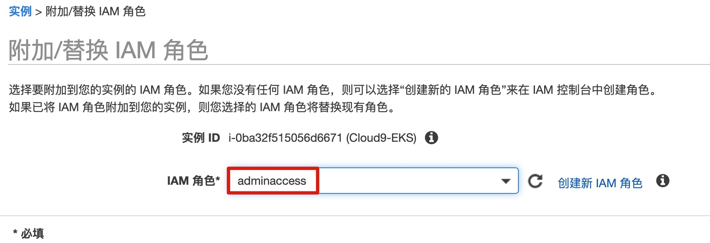

# 步骤1 - 准备实验环境


本次 Workshop 实验中，我们会启动 Cloud9 并在上面部署实验所需的各个工具，包括：awscli v2, eksctl , kubectl 等, 并为 Cloud9 所在实例赋予相应的 IAM 权限。

本次实验全部基于 AWS 北京区域 进行。


## 创建 Cloud9 环境

### 启动 Cloud9 实例

登录 AWS 中国区控制台界面，切换到 **北京** 区域。

进入 EC2 界面，选择 启动实例，搜索 Cloud9，选择 AWS Marketplace 中的 **Web IDE based on Cloud9** 启动一个 Cloud9 实例。



*注意：将 Cloud9 实例启动在公共子网中并为其 自动分配公网 IP 以便可基于实例的 Web IDE 进行后续实验操作。*

其他选项保持默认即可。

### 登录 Cloud9 Web IDE

实例创建完成后，可通过 **<u>*http://实例公有IP地址或域名:8181*</u>** 访问 Web IDE。

- *用户名：aws*
- *密码：实例 ID*



关于在 北京 区域启动 Cloud9 Web IDE 的详细步骤，可参考 https://github.com/linjungz/cloud9

### 为 Cloud9 实例赋予 IAM 权限

1. **创建 IAM 角色**

   进入 IAM 角色 界面，选择 **创建角色**，使用案例 选择 EC2，然后点击 下一步：权限

   

   在下一步中选择 **AdministratorAccess** 权限，点击下一步；

   

   

   在最后 **审核** 的界面，填写 角色名称 **adminaccess** 然后点击 **创建角色**。

   

   

2. **添加 IAM 角色到 Cloud9 实例**

   在 EC2 界面上找到刚才创建的 Cloud9 实例，然后选择: **操作 -->实例设置 --> 附加/替换 IAM 角色**

   

   选择刚才创建的 IAM 角色，附加到该 Cloud9 实例上。

   


## 配置实验环境

在 Cloud9 Web IDE 上，根据以下步骤安装 awscli，eksctl，kubectl 等工具

### 安装 AWS CLI

使用以下命令安装 AWS CLI version 2，详细信息可参考 https://docs.aws.amazon.com/cli/latest/userguide/install-cliv2-linux.html#cliv2-linux-upgrade

``` bash
curl "https://awscli.amazonaws.com/awscli-exe-linux-x86_64.zip" -o "awscliv2.zip"
unzip awscliv2.zip
sudo ./aws/install
```

安装完成后可以验证 AWS CLI 版本

```bash
[ec2-user@ip-172-31-19-174 workspace]$ aws --version
aws-cli/2.1.13 Python/3.7.3 Linux/4.14.123-111.109.amzn2.x86_64 exe/x86_64.amzn.2 prompt/off
```

### 安装 eksctl

使用以下命令安装 eksctl，详细信息可参考 https://docs.aws.amazon.com/eks/latest/userguide/eksctl.html

```bash
curl --silent --location "https://github.com/weaveworks/eksctl/releases/latest/download/eksctl_$(uname -s)_amd64.tar.gz" | tar xz -C /tmp
sudo mv /tmp/eksctl /usr/local/bin
```

安装完成后可以验证 eksctl 版本

```bash
[ec2-user@ip-172-31-19-174 workspace]$ eksctl version
0.34.0
```

### 安装 kubectl

使用以下命令安装 kubectl，详细信息可参考 https://docs.aws.amazon.com/eks/latest/userguide/install-kubectl.html

```bash
curl -o kubectl https://amazon-eks.s3.cn-north-1.amazonaws.com.cn/1.18.9/2020-11-02/bin/linux/amd64/kubectl
chmod +x ./kubectl
sudo mv ./kubectl /usr/local/bin
```

安装完成后可以验证 eksctl 版本

```bash
[ec2-user@ip-172-31-19-174 workspace]$ kubectl version --short --client
Client Version: v1.18.9-eks-d1db3c
```

### 安装 jq 等其他工具

使用以下命令安装 jq 等其他工具

```bash
sudo yum -y install jq gettext bash-completion moreutils
echo 'yq() {
  docker run --rm -i -v "${PWD}":/workdir mikefarah/yq yq "$@"
}' | tee -a ~/.bashrc && source ~/.bashrc
kubectl completion bash >>  ~/.bash_completion
. /etc/profile.d/bash_completion.sh
. ~/.bash_completion
```


验证工具都已经正确安装

```bash
for command in kubectl jq envsubst aws
  do
    which $command &>/dev/null && echo "$command in path" || echo "$command NOT FOUND"
  done
```


