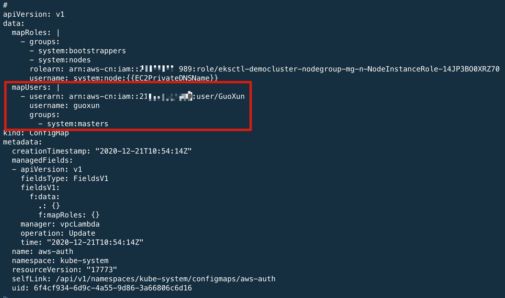

# 步骤2 - 创建 EKS 集群

## 创建 EKS 集群

使用 eksctl 创建 EKS 集群，在以下命令中替换集群名称、节点组名称、ssh 公钥 名称

```bash
eksctl create cluster \
--name democluster \
--version 1.18 \
--region cn-north-1 \
--nodegroup-name mg-nodegroup-1 \
--nodes 2 \
--nodes-min 1 \
--nodes-max 5 \
--with-oidc \
--ssh-access \
--ssh-public-key gxchina \
--managed
```

集群创建大约需要 10-15 分钟，在界面上可以看到 eksctl 创建日志。

```bash
[ec2-user@ip-172-31-19-174 workspace]$ eksctl create cluster \
> --name democluster \
> --version 1.18 \
> --region cn-north-1 \
> --nodegroup-name mg-nodegroup-1 \
> --nodes 2 \
> --nodes-min 1 \
> --nodes-max 5 \
> --with-oidc \
> --ssh-access \
> --ssh-public-key gxchina \
> --managed
[ℹ]  eksctl version 0.34.0
[ℹ]  using region cn-north-1
[ℹ]  setting availability zones to [cn-north-1a cn-north-1b cn-north-1a]
[ℹ]  subnets for cn-north-1a - public:192.168.0.0/19 private:192.168.96.0/19
[ℹ]  subnets for cn-north-1b - public:192.168.32.0/19 private:192.168.128.0/19
[ℹ]  subnets for cn-north-1a - public:192.168.64.0/19 private:192.168.160.0/19
[ℹ]  using EC2 key pair %!!(MISSING)q(*string=<nil>)
[ℹ]  using Kubernetes version 1.18
[ℹ]  creating EKS cluster "democluster" in "cn-north-1" region with managed nodes
[ℹ]  will create 2 separate CloudFormation stacks for cluster itself and the initial managed nodegroup
[ℹ]  if you encounter any issues, check CloudFormation console or try 'eksctl utils describe-stacks --region=cn-north-1 --cluster=democluster'
[ℹ]  CloudWatch logging will not be enabled for cluster "democluster" in "cn-north-1"
[ℹ]  you can enable it with 'eksctl utils update-cluster-logging --enable-types={SPECIFY-YOUR-LOG-TYPES-HERE (e.g. all)} --region=cn-north-1 --cluster=democluster'
[ℹ]  Kubernetes API endpoint access will use default of {publicAccess=true, privateAccess=false} for cluster "democluster" in "cn-north-1"
[ℹ]  2 sequential tasks: { create cluster control plane "democluster", 3 sequential sub-tasks: { 3 sequential sub-tasks: { associate IAM OIDC provider, 2 sequential sub-tasks: { create IAM role for serviceaccount "kube-system/aws-node", create serviceaccount "kube-system/aws-node" }, restart daemonset "kube-system/aws-node" }, create addons, create managed nodegroup "mg-nodegroup-1" } }
[ℹ]  building cluster stack "eksctl-democluster-cluster"
[ℹ]  deploying stack "eksctl-democluster-cluster"
...
```


## 验证 EKS 集群

集群创建完成后，可在 EKS 界面看到集群的信息和状态。如果界面显示如下报错 *Your current user or role does not have access to Kubernetes objects on this EKS cluster*，可编辑 aws-auth ConfigMap 添加用户映射，赋予登录 AWS Console 的用户 Kubernetes 的 RBAC 权限。详细信息可参考 https://docs.aws.amazon.com/eks/latest/userguide/add-user-role.html 

编辑 aws-auth ConfigMap 添加用户映射

```bash
kubectl describe cm aws-auth -n kube-system
```

添加 mapUsers 字段如下，其中 userarn 和 username 替换成自己的用户 arn 和用户名，可在 IAM 用户界面查看。

```yaml
mapUsers: |
- userarn: <your_user_arn>
  username: <your_user_name>
  groups:
    - system:masters
```



修改完 aws-auth 之后可在 EKS 界面查看集群信息。


在 Cloud9 Web IDE 终端可使用 kubectl 获取 EKS 集群信息。

```bash
[ec2-user@ip-172-31-19-174 workspace]$ kubectl get nodes -o wide
NAME                                            STATUS   ROLES    AGE   VERSION              INTERNAL-IP      EXTERNAL-IP     OS-IMAGE         KERNEL-VERSION                  CONTAINER-RUNTIME
ip-192-168-36-195.cn-north-1.compute.internal   Ready    <none>   18m   v1.18.9-eks-d1db3c   192.168.36.195   52.80.95.147    Amazon Linux 2   4.14.209-160.335.amzn2.x86_64   docker://19.3.6
ip-192-168-87-47.cn-north-1.compute.internal    Ready    <none>   18m   v1.18.9-eks-d1db3c   192.168.87.47    52.81.236.155   Amazon Linux 2   4.14.209-160.335.amzn2.x86_64   docker://19.3.6
```


## 下载实验使用的 git repo

下载实验使用的 git repository，后续实验所需的 yaml 文件在 resources 目录下可找到。

```bash
git clone  https://github.com/guoxun19/gcr-eks-workshop.git
cd gcr-eks-workshop
```


## 配置中国区镜像

由于网络原因，海外 gcr.io 或 quay.io 等镜像源可能无法下载，为了不手动修改原始 yaml 文件的镜像路径，可使用 [amazon-api-gateway-mutating-webhook-for-k8](https://github.com/aws-samples/amazon-api-gateway-mutating-webhook-for-k8) 项目实现镜像自动映射。本 Workshop 所需要的镜像由 nwcd/container-mirror 准备好了，部署 MutatingWebhookConfiguration 即可。

部署 mutating-webhook

```bash
kubectl apply -f https://raw.githubusercontent.com/nwcdlabs/container-mirror/master/webhook/mutating-webhook.yaml
```

如果无法连接到 raw.githubusercontent.com 直接部署，可使用 resources/webhook 下面的 yaml 文件来部署

```bash
kubectl apply -f resources/mutating-webhook/mutating-webhook.yaml
```


webhook 部署完成后，创建一个 nginx service 检查 webhook 是否正常工作

```bash
kubectl apply -f resources/nginx-app/nginx-nlb.yaml
```

验证 nginx service 和 pod 正常运行。为避免中国区备案问题，我们将 service 端口设为 28080.

```bash
[ec2-user@ip-172-31-19-174 workspace]$ kubectl get svc,deploy,po
NAME                    TYPE           CLUSTER-IP       EXTERNAL-IP                                                                         PORT(S)        AGE
service/kubernetes      ClusterIP      10.100.0.1       <none>                                                                              443/TCP        3h6m
service/service-nginx   LoadBalancer   10.100.186.111   a40ddad4121f74da6bee4dacbf056e87-0dcb806a4efcaaf2.elb.cn-north-1.amazonaws.com.cn   28080:31324/TCP   10m

NAME                               READY   UP-TO-DATE   AVAILABLE   AGE
deployment.apps/nginx-deployment   1/1     1            1           10m

NAME                                   READY   STATUS    RESTARTS   AGE
pod/nginx-deployment-d46f5678b-w72lg   1/1     Running   0          10m
```

稍等一段时间后（等待 pod 挂载到 NLB 并通过健康检查），访问 nginx service 负载均衡器地址

```bash
ELB=$(kubectl get service service-nginx -o json | jq -r '.status.loadBalancer.ingress[].hostname')
PORT=$(kubectl get service service-nginx -o json | jq -r '.spec.ports[].port')
echo $ELB:$PORT
curl -i $ELB:$PORT
```

可以看到访问正常

```bash
[ec2-user@ip-172-31-19-174 workspace]$ ELB=$(kubectl get service service-nginx -o json | jq -r '.status.loadBalancer.ingress[].hostname')
[ec2-user@ip-172-31-19-174 workspace]$ PORT=$(kubectl get service service-nginx -o json | jq -r '.spec.ports[].port')
[ec2-user@ip-172-31-19-174 workspace]$ curl -i $ELB:$PORT
HTTP/1.1 200 OK
Server: nginx/1.19.6
Date: Mon, 21 Dec 2020 13:56:08 GMT
Content-Type: text/html
Content-Length: 612
Last-Modified: Tue, 15 Dec 2020 13:59:38 GMT
Connection: keep-alive
ETag: "5fd8c14a-264"
Accept-Ranges: bytes

<!DOCTYPE html>
<html>
<head>
<title>Welcome to nginx!</title>
<style>
    body {
        width: 35em;
        margin: 0 auto;
        font-family: Tahoma, Verdana, Arial, sans-serif;
    }
</style>
</head>
<body>
<h1>Welcome to nginx!</h1>
<p>If you see this page, the nginx web server is successfully installed and
working. Further configuration is required.</p>

<p>For online documentation and support please refer to
<a href="http://nginx.org/">nginx.org</a>.<br/>
Commercial support is available at
<a href="http://nginx.com/">nginx.com</a>.</p>

<p><em>Thank you for using nginx.</em></p>
</body>
</html>
```

查看 Pod 中 container image 是否被 webhook 改写成 中国区 ECR 的地址。

其中，Pod 名称替换为你自己环境的 Pod 名称。

```bash
[ec2-user@ip-172-31-19-174 workspace]$ kubectl get pod/nginx-deployment-d46f5678b-w72lg -o=jsonpath='{.spec.containers[0].image}'                                                                            
048912060910.dkr.ecr.cn-northwest-1.amazonaws.com.cn/dockerhub/nginx
```


最后，配置 工作节点组 的角色信息，以便在后续的实验步骤中可以用到。注意 cluster 名称替换成自己的 EKS 集群名称。

```bash
STACK_NAME=$(eksctl get nodegroup --cluster democluster -o json | jq -r '.[].StackName')
ROLE_NAME=$(aws cloudformation describe-stack-resources --stack-name $STACK_NAME | jq -r '.StackResources[] | select(.ResourceType=="AWS::IAM::Role") | .PhysicalResourceId')
echo "export ROLE_NAME=${ROLE_NAME}" | tee -a ~/.bash_profile
```

