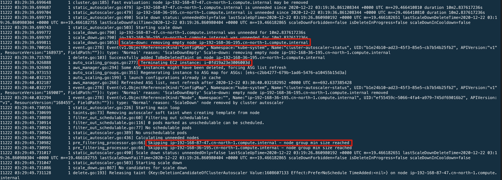
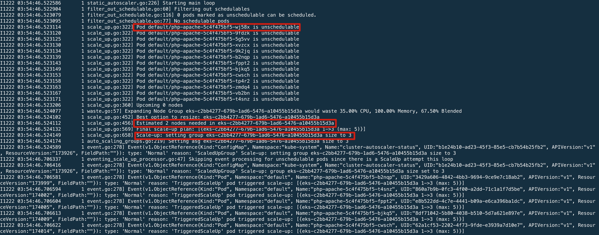

# 步骤3 - 使用 HPA 和 CA 实现 Pod 与集群的自动伸缩


## HPA 与 Pod 自动伸缩

Kubernetes [Horizontal Pod Autoscaler](https://kubernetes.io/docs/tasks/run-application/horizontal-pod-autoscale/) 根据资源的 CPU 利用率，自动扩展 deployment、replication controller 或 replica set 中的 Pod 数量。HPA 是 Kubernetes 中的标准 API 资源，只需在 Amazon EKS 集群上安装一个指标源（如 Kubernetes Metrics Server）即可正常运行。

在本实验中，我们会先安装 Metrics Server 用于提供 HPA 所需的指标，然后创建一个 php-apache 示例应用并为其创建 HPA 资源，最后通过压测 php-apache 应用来观察 HPA 执行扩展的情况。

### 安装 Metrics Server

使用以下命令安装 Metrics Server

```bash
kubectl apply -f https://github.com/kubernetes-sigs/metrics-server/releases/download/v0.3.6/components.yaml 
```

安装完成后验证是否正常运行

```bash
[ec2-user@ip-172-31-19-174 workspace]$ kubectl get deployment metrics-server -n kube-system
NAME             READY   UP-TO-DATE   AVAILABLE   AGE
metrics-server   1/1     1            1           12s
```


### 创建示例应用和 HPA 资源

创建一个简单的 Apache Web Server 示例应用

```bash
kubectl apply -f https://k8s.io/examples/application/php-apache.yaml
```

为该应用创建 Horizontal Pod Autoscaler 资源。此命令创建 HPA 资源并将  CPU 利用率目标设定为 50%， Pod 的最小最大值分别为 1 和 10。当平均 CPU 负载低于 50% 时，HPA 会尝试减少部署中的 Pod 数量至最少 1 个。当平均 CPU 负载大于 50% 时，HPA 会尝试增加部署中的 Pod 数量至最高 10 个。

```bash
kubectl autoscale deployment php-apache --cpu-percent=50 --min=1 --max=10
```

查看 HPA 资源创建的情况

```bash
[ec2-user@ip-172-31-19-174 workspace]$ kubectl describe hpa php-apache
Name:                                                  php-apache
Namespace:                                             default
Labels:                                                <none>
Annotations:                                           <none>
CreationTimestamp:                                     Mon, 21 Dec 2020 14:47:44 +0000
Reference:                                             Deployment/php-apache
Metrics:                                               ( current / target )
  resource cpu on pods  (as a percentage of request):  0% (1m) / 50%
Min replicas:                                          1
Max replicas:                                          10
Deployment pods:                                       1 current / 1 desired
Conditions:
  Type            Status  Reason               Message
  ----            ------  ------               -------
  AbleToScale     True    ScaleDownStabilized  recent recommendations were higher than current one, applying the highest recent recommendation
  ScalingActive   True    ValidMetricFound     the HPA was able to successfully calculate a replica count from cpu resource utilization (percentage of request)
  ScalingLimited  False   DesiredWithinRange   the desired count is within the acceptable range
Events:           <none>
```


### 通过压测观察 HPA 自动伸缩

HPA 资源创建完成后，创建一个 Pod 实施压测

```bash
kubectl run -it --rm load-generator --image=busybox /bin/sh --generator=run-pod/v1
```

进入该 Pod 后，运行压测命令

```bash
[ec2-user@ip-172-31-19-174 workspace]$ kubectl run -it --rm load-generator --image=busybox /bin/sh --generator=run-pod/v1
Flag --generator has been deprecated, has no effect and will be removed in the future.

If you don't see a command prompt, try pressing enter.

/ # while true; do wget -q -O- http://php-apache; done
OK!OK!OK!OK!OK!OK!OK!OK!OK!OK!OK!OK!OK!OK!OK!OK!OK!OK!OK!OK!OK!OK!OK!OK!OK!OK!OK!OK!OK!OK!OK!OK!OK!OK!OK!OK!OK!OK!OK!OK!OK!OK!OK!OK!OK!OK!OK!OK!OK!OK!OK!OK!OK!OK!OK!OK!OK!OK!OK!OK!
```


然后另外开启一个终端观察 HPA 的状态，可以看到 HPA 创建了多个 Pod 以使得平均 CPU 利用率接近 50%

```bash
[ec2-user@ip-172-31-19-174 workspace]$ kubectl get hpa -w
NAME         REFERENCE               TARGETS   MINPODS   MAXPODS   REPLICAS   AGE
php-apache   Deployment/php-apache   0%/50%    1         10        1          3m24s
php-apache   Deployment/php-apache   250%/50%   1         10        1          4m3s
php-apache   Deployment/php-apache   250%/50%   1         10        4          4m19s
php-apache   Deployment/php-apache   250%/50%   1         10        5          4m34s
php-apache   Deployment/php-apache   69%/50%    1         10        5          5m4s
php-apache   Deployment/php-apache   69%/50%    1         10        6          5m20s
php-apache   Deployment/php-apache   57%/50%    1         10        6          6m5s
php-apache   Deployment/php-apache   57%/50%    1         10        7          6m21s
php-apache   Deployment/php-apache   53%/50%    1         10        7          7m6s
php-apache   Deployment/php-apache   49%/50%    1         10        7          8m7s
...
```

观察 php-apache Pod 的创建情况

```bash
[ec2-user@ip-172-31-19-174 workspace]$ kubectl get po -w
NAME                               READY   STATUS    RESTARTS   AGE
load-generator                     1/1     Running   0          5m22s
nginx-deployment-d46f5678b-w72lg   1/1     Running   0          70m
php-apache-5c4f475bf5-4pshd        1/1     Running   0          3m56s
php-apache-5c4f475bf5-5q6tj        1/1     Running   0          2m56s
php-apache-5c4f475bf5-fbkxr        1/1     Running   0          3m56s
php-apache-5c4f475bf5-hjzrn        1/1     Running   0          3m41s
php-apache-5c4f475bf5-j5gfj        1/1     Running   0          115s
php-apache-5c4f475bf5-klh7r        1/1     Running   0          8m57s
php-apache-5c4f475bf5-zlr5m        1/1     Running   0          3m56s
...
```


中断压测程序，HPA 会根据 Pod 负载情况减少 Pod 数量。

```bash
[ec2-user@ip-172-31-19-174 workspace]$ kubectl get hpa -w
NAME         REFERENCE               TARGETS   MINPODS   MAXPODS   REPLICAS   AGE
php-apache   Deployment/php-apache   0%/50%    1         10        7          14m
php-apache   Deployment/php-apache   0%/50%    1         10        7          16m
php-apache   Deployment/php-apache   0%/50%    1         10        1          16m
```

*注：缩减的默认时间范围是 5 分钟，因此即使当前 CPU 百分比为 0%，还是需要等待一些才能看到 Pod 数量的减少。时间范围可以修改，详细信息可参考 Kubernetes 文档中的 [Horizontal Pod Autoscaler](https://kubernetes.io/docs/tasks/run-application/horizontal-pod-autoscale/)。*


## CA 与 工作节点 自动伸缩

Kubernetes [Cluster Autoscaler](https://github.com/kubernetes/autoscaler/tree/master/cluster-autoscaler) 在 Pod 由于缺少资源而无法启动时，或者在集群中的节点利用率不足使其 Pod 可以重新调度到集群中的其他节点上时，自动调整集群中的节点数。CA 在 Amazon EKS 集群中通过与 Amazon EC2 Auto Scaling 组结合来实现对节点组资源的自动伸缩。

### 为 Cluster Autoscaler 配置 IAM 策略

创建 CA 所需的 IAM 策略，并附加 IAM 策略到工作节点角色上。

```json
cat << EOF > ca-policy.json 
{
     "Version": "2012-10-17",
     "Statement": [
         {
             "Action": [
                 "autoscaling:DescribeAutoScalingGroups",
                 "autoscaling:DescribeAutoScalingInstances",
                 "autoscaling:DescribeLaunchConfigurations",
                 "autoscaling:DescribeTags",
                 "autoscaling:SetDesiredCapacity",
                 "autoscaling:TerminateInstanceInAutoScalingGroup",
                 "ec2:DescribeLaunchTemplateVersions"
             ],
             "Resource": "*",
             "Effect": "Allow"
         }
     ]
}
EOF
```

先检查是否记录了工作节点角色名称，注意 cluster 名称替换成自己的集群名。

```bash
STACK_NAME=$(eksctl get nodegroup --cluster democluster -o json | jq -r '.[].StackName')
ROLE_NAME=$(aws cloudformation describe-stack-resources --stack-name $STACK_NAME | jq -r '.StackResources[] | select(.ResourceType=="AWS::IAM::Role") | .PhysicalResourceId')
echo "export ROLE_NAME=${ROLE_NAME}" | tee -a ~/.bash_profile
```

以下是工作节点角色名称示例

```bash
[ec2-user@ip-172-31-19-174 workspace]$ echo $ROLE_NAME
eksctl-democluster-nodegroup-mg-n-NodeInstanceRole-14JP3BO0XRZ70
```

将刚才创建的 IAM 策略附加到上述工作节点角色上

```bash
aws iam put-role-policy --role-name $ROLE_NAME --policy-name CA-Policy-For-Node --policy-document file://./ca-policy.json
```

检查策略已经正确附加

```bash
[ec2-user@ip-172-31-19-174 workspace]$ aws iam get-role-policy --role-name $ROLE_NAME --policy-name CA-Policy-For-Node                                                                                       
{
    "RoleName": "eksctl-democluster-nodegroup-mg-n-NodeInstanceRole-14JP3BO0XRZ70",
    "PolicyName": "CA-Policy-For-Node",
    "PolicyDocument": {
        "Version": "2012-10-17",
        "Statement": [
            {
                "Action": [
                    "autoscaling:DescribeAutoScalingGroups",
                    "autoscaling:DescribeAutoScalingInstances",
                    "autoscaling:DescribeLaunchConfigurations",
                    "autoscaling:DescribeTags",
                    "autoscaling:SetDesiredCapacity",
                    "autoscaling:TerminateInstanceInAutoScalingGroup",
                    "ec2:DescribeLaunchTemplateVersions"
                ],
                "Resource": "*",
                "Effect": "Allow"
            }
        ]
    }
}
```


### 安装 Cluster Autoscaler

下载 Cluster Autoscaler manifest 文件

```bash
curl -o cluster-autoscaler-autodiscover.yaml https://raw.githubusercontent.com/kubernetes/autoscaler/master/cluster-autoscaler/cloudprovider/aws/examples/cluster-autoscaler-autodiscover.yaml
```

如果无法连接到 raw.githubusercontent.com 下载，可使用 resources/cluster-autoscaler 下面的 yaml 文件。打开 cluster-autoscaler-autodiscover.yaml 文件，将  **<YOUR_CLUSTER_NAME>** 替换成自己的集群名称。

```yaml
command:
  - ./cluster-autoscaler
  - --v=4
  - --stderrthreshold=info
  - --cloud-provider=aws
  - --skip-nodes-with-local-storage=false
  - --expander=least-waste
  - --node-group-auto-discovery=asg:tag=k8s.io/cluster-autoscaler/enabled,k8s.io/cluster-autoscaler/<YOUR_CLUSTER_NAME>
  - --balance-similar-node-groups
  - --skip-nodes-with-system-pods=false
```

保存 yaml 文件之后，进入文件所在目录，部署 Cluster Autoscaler。

```bash
kubectl apply -f cluster-autoscaler-autodiscover.yaml
```

查看 CA 所在 Pod 的日志，检查 CA 是否正常运行。注意将以下 Pod 名称替换成自己的 CA Pod 名称。

```bash
[ec2-user@ip-172-31-19-174 workspace]$ kubectl get po -n kube-system | grep cluster-autoscaler
cluster-autoscaler-57b554d68-mf5c9   1/1     Running   0          4m38s
[ec2-user@ip-172-31-19-174 workspace]$ kubectl logs cluster-autoscaler-57b554d68-mf5c9 -n kube-system --tail=10
I1222 03:12:11.524670       1 cluster.go:306] Pod kube-system/coredns-74c8b6b7dd-qqmvz can be moved to ip-192-168-36-195.cn-north-1.compute.internal
I1222 03:12:11.524683       1 cluster.go:185] Fast evaluation: node ip-192-168-87-47.cn-north-1.compute.internal may be removed
I1222 03:12:11.524688       1 cluster.go:148] Fast evaluation: ip-192-168-36-195.cn-north-1.compute.internal for removal
I1222 03:12:11.524727       1 cluster.go:306] Pod default/nginx-deployment-d46f5678b-w72lg can be moved to ip-192-168-87-47.cn-north-1.compute.internal
I1222 03:12:11.524781       1 cluster.go:306] Pod kube-system/coredns-74c8b6b7dd-tzxl5 can be moved to ip-192-168-87-47.cn-north-1.compute.internal
I1222 03:12:11.524805       1 cluster.go:306] Pod kube-system/cluster-autoscaler-57b554d68-mf5c9 can be moved to ip-192-168-87-47.cn-north-1.compute.internal
I1222 03:12:11.524815       1 cluster.go:185] Fast evaluation: node ip-192-168-36-195.cn-north-1.compute.internal may be removed
I1222 03:12:11.524852       1 static_autoscaler.go:479] ip-192-168-87-47.cn-north-1.compute.internal is unneeded since 2020-12-22 03:09:00.687004608 +0000 UTC m=+29.415090626 duration 3m10.836997607s
I1222 03:12:11.524867       1 static_autoscaler.go:479] ip-192-168-36-195.cn-north-1.compute.internal is unneeded since 2020-12-22 03:09:00.687004608 +0000 UTC m=+29.415090626 duration 3m10.836997607s
I1222 03:12:11.524880       1 static_autoscaler.go:490] Scale down status: unneededOnly=true lastScaleUpTime=2020-12-22 03:08:50.68663318 +0000 UTC m=+19.414719205 lastScaleDownDeleteTime=2020-12-22 03:08:50.686633334 +0000 UTC m=+19.414719304 lastScaleDownFailTime=2020-12-22 03:08:50.686633423 +0000 UTC m=+19.414719400 scaleDownForbidden=false isDeleteInProgress=false scaleDownInCooldown=true
```

为 Cluster Autoscaler 添加 cluster-autoscaler.kubernetes.io/safe-to-evict 注释

```bash
kubectl -n kube-system annotate deployment.apps/cluster-autoscaler cluster-autoscaler.kubernetes.io/safe-to-evict="false"
```


### 使用 Cluster Autoscaler 实现节点自动伸缩

Cluster Autoscaler 默认启用了 scale down，会持续评估节点的 CPU 利用率并判断是否启动节点缩减。在本实验步骤 2 中创建 EKS 集群时工作节点的数量设为 2，节点上运行的 Pod 数量并不多，可以通过 CA 日志观察到 10 分钟（可通过 `scale-down-unneeded-time` 配置，默认为 10 分钟）后触发了 scale down，关闭一个节点后达到 ASG 配置的最小值 1，缩减停止。



通过 kubectl 也可查看到节点数量的变化，以及在 scale down 过程中状态的变化。

```bash
[ec2-user@ip-172-31-19-174 workspace]$ kubectl get node
NAME                                            STATUS                     ROLES    AGE   VERSION
ip-192-168-36-195.cn-north-1.compute.internal   Ready,SchedulingDisabled   <none>   16h   v1.18.9-eks-d1db3c
ip-192-168-87-47.cn-north-1.compute.internal    Ready                      <none>   16h   v1.18.9-eks-d1db3c
[ec2-user@ip-172-31-19-174 workspace]$ kubectl get node
NAME                                           STATUS   ROLES    AGE   VERSION
ip-192-168-87-47.cn-north-1.compute.internal   Ready    <none>   16h   v1.18.9-eks-d1db3c
```


接下来我们之前部署的 php-apache 应用的副本数扩展到 10，观察是否触发 CA 对节点的扩展。

```bash
[ec2-user@ip-172-31-19-174 workspace]$ kubectl scale deployment php-apache --replicas=10
deployment.apps/php-apache scaled
```

通过 CA 日志可以观察到，Pod 由于资源不足无法调度，触发了节点扩展。CA 通过计算所需的节点数后，将 ASG 的大小设置成了 3 ，增加了两个工作节点。



节点扩展完成后，所有 Pod 都被调度并正常运行，通过 kubectl 也可以看到新增节点的信息。

```bash
[ec2-user@ip-172-31-19-174 workspace]$ kubectl get po 
NAME                               READY   STATUS    RESTARTS   AGE
nginx-deployment-d46f5678b-4thch   1/1     Running   0          38m
php-apache-5c4f475bf5-78qfc        1/1     Running   0          2m29s
php-apache-5c4f475bf5-bjkq5        1/1     Running   0          2m29s
php-apache-5c4f475bf5-fcxnm        1/1     Running   0          2m29s
php-apache-5c4f475bf5-fppt2        1/1     Running   0          2m29s
php-apache-5c4f475bf5-klh7r        1/1     Running   0          13h
php-apache-5c4f475bf5-l6zhr        1/1     Running   0          2m29s
php-apache-5c4f475bf5-m46k7        1/1     Running   0          2m29s
php-apache-5c4f475bf5-mn7tf        1/1     Running   0          2m29s
php-apache-5c4f475bf5-p28ld        1/1     Running   0          2m29s
php-apache-5c4f475bf5-t4snz        1/1     Running   0          2m29s
[ec2-user@ip-172-31-19-174 workspace]$ kubectl get nodes
NAME                                            STATUS   ROLES    AGE    VERSION
ip-192-168-33-237.cn-north-1.compute.internal   Ready    <none>   108s   v1.18.9-eks-d1db3c
ip-192-168-56-0.cn-north-1.compute.internal     Ready    <none>   112s   v1.18.9-eks-d1db3c
ip-192-168-87-47.cn-north-1.compute.internal    Ready    <none>   17h    v1.18.9-eks-d1db3c
```


