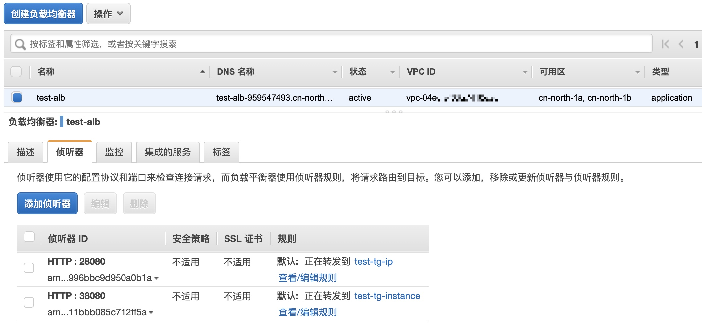
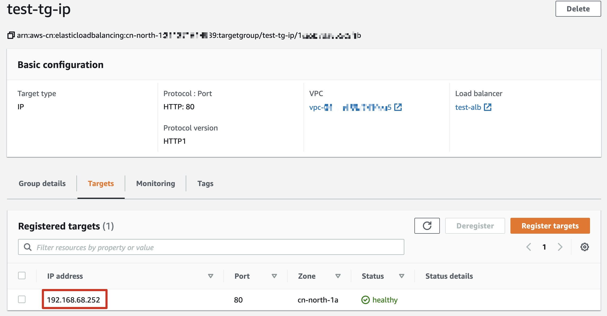
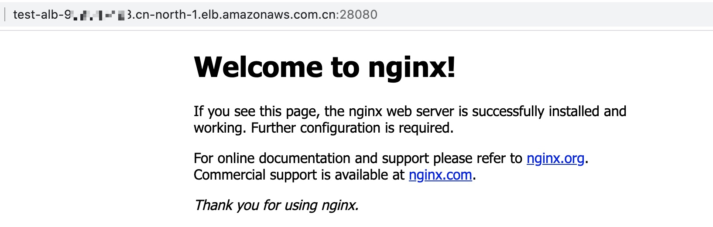
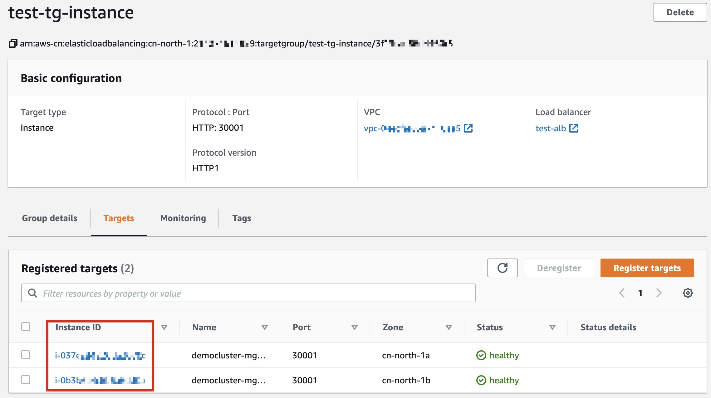
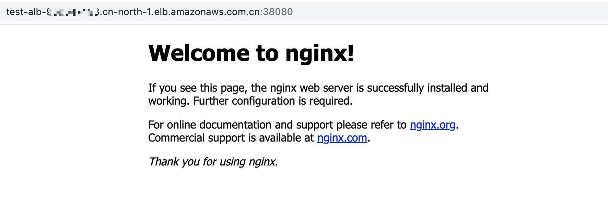
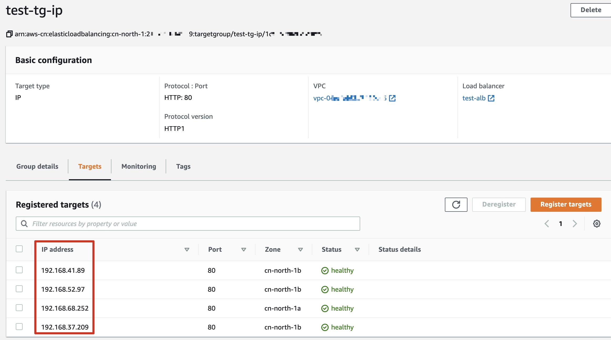
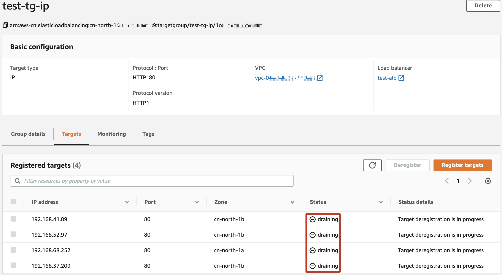

# 步骤4 - Kubernetes Service 与 Ingress


Kubernetes 的 Service 和 Ingress 可以 AWS ELB 集成。其中，

- 对于 Kubernetes Service，可以使用 AWS 网络负载均衡器 (NLB，instance 或 IP 模式) 或 传统负载均衡器 (CLB，仅 instance 模式) 对跨 Pod 的 4 层网络流量进行负载均衡。
- 对于 Kubernetes Ingress，可以使用 AWS 应用负载均衡器 (ALB，instance 或 IP 模式) 对跨 Pod 的 7 层网络流量进行负载均衡。

对于 Kubernetes Service 的 4 层网络流量，当使用 instance 模式将流量负载均衡到目标时，Kubernetes in-tree 的负载均衡控制器会负责创建 NLB (instance 模式) 或 CLB，不需要额外部署任何控制器，只需要将 Service Type 设置为 LoadBalancer 即可。

如果 Service 要使用 NLB - IP 模式 或者 使用 ALB 实现 7 层网络流量的转发，则需要部署 AWS Load Balancer Controller，由这个控制器来实现负载均衡器的创建和配置。

[AWS Load Balancer Controller](https://github.com/kubernetes-sigs/aws-load-balancer-controller) 是一个控制器，可帮助管理 Kubernetes 集群的 Elastic Load Balancer。

- 它通过部署和配置 Application Load Balancers - ALB 来提供 Kubernetes Ingress 资源。
- 它通过部署和配置 Network Load Balancers - NLB 来提供 Kubernetes Service 资源。


在本实验中，我们会部署 AWS Load Balancer Controller，并实现 Kubernetes Service 和 Ingress 资源与 AWS NLB/ALB 的集成。

## Kubernetes in-tree Load Balancer Controller

在部署 AWS Load Balancer Controller 之前，我们可以查看在 步骤 2 创建 EKS 集群 时 创建的 nginx service。该 Kubnernetes Service 使用的是 Kubernetes in-tree 的负载均衡控制器，Service Type 为 LoadBalancer，并通过 annotation 指定负载均衡器类型为 NLB。

```bash
[ec2-user@ip-172-31-19-174 workspace]$ kubectl describe svc service-nginx                                                                                                                                    
Name:                     service-nginx
Namespace:                default
Labels:                   <none>
Annotations:              service.beta.kubernetes.io/aws-load-balancer-type: nlb
Selector:                 app=nginx
Type:                     LoadBalancer
IP:                       10.100.186.111
LoadBalancer Ingress:     a40ddad4121f74da6bee4dacbf056e87-0dcb806a4efcaaf2.elb.cn-north-1.amazonaws.com.cn
Port:                     <unset>  28080/TCP
TargetPort:               80/TCP
NodePort:                 <unset>  31324/TCP
Endpoints:                192.168.68.252:80
Session Affinity:         None
External Traffic Policy:  Cluster
Events:                   <none>
```

创建 Service 的 yaml 文件如下：

```yaml
---
apiVersion: v1
kind: Service
metadata:
  name: "service-nginx"
  annotations:
        service.beta.kubernetes.io/aws-load-balancer-type: nlb
spec:
  selector:
    app: nginx
  type: LoadBalancer
  ports:
  - protocol: TCP
    port: 28080
    targetPort: 80
```

通过 AWS Console 可查看该 NLB 的目标组类型为 instance。


接下来我们部署  AWS Load Balancer Controller 并实现  NLB - IP 模式 以及 与 ALB 的集成。


## 部署 AWS Load Balancer Controller

### 创建 IAM 策略

下载中国区 IAM 策略文件

```bash
curl -o lb_controller_iam_policy_cn.json https://raw.githubusercontent.com/kubernetes-sigs/aws-load-balancer-controller/v2.1.0/docs/install/iam_policy_cn.json
```

如果无法连接到 raw.githubusercontent.com 下载，可使用 resources/aws-loadbalancer-controller 下面的策略文件 lb_controller_iam_policy_cn.json

进入文件所在目录，使用策略文件创建 IAM 策略

```bash
aws iam create-policy \
 --policy-name AWSLoadBalancerControllerIAMPolicy \
 --policy-document file://lb_controller_iam_policy_cn.json
```

记录返回的 策略 ARN，示例如下


### 创建 IAM role 和 service account

创建 IAM role 和 Kubernetes service account，以及相应的 cluster role 和 cluster role binding 供 AWS Load Balancer Controller 后续使用。执行如下命令，注意将 cluster 名称和 policy-arn 替换成你自己的值。

```bash
eksctl create iamserviceaccount \
  --cluster=democluster \
  --namespace=kube-system \
  --name=aws-load-balancer-controller \
  --attach-policy-arn=arn:aws-cn:iam::<ACCOUNT_ID>:policy/AWSLoadBalancerControllerIAMPolicy \
  --override-existing-serviceaccounts \
  --approve
```

创建完成后，可以开始部署 AWS Load Balancer Controller。以下是 eksctl 创建 service account 的输出信息。

```bash
[ℹ]  eksctl version 0.34.0
[ℹ]  using region cn-north-1
[ℹ]  1 existing iamserviceaccount(s) (kube-system/aws-node) will be excluded
[ℹ]  1 iamserviceaccount (kube-system/aws-load-balancer-controller) was included (based on the include/exclude rules)
[ℹ]  1 iamserviceaccount (kube-system/aws-node) was excluded (based on the include/exclude rules)
[!]  metadata of serviceaccounts that exist in Kubernetes will be updated, as --override-existing-serviceaccounts was set
[ℹ]  1 task: { 2 sequential sub-tasks: { create IAM role for serviceaccount "kube-system/aws-load-balancer-controller", create serviceaccount "kube-system/aws-load-balancer-controller" } }
[ℹ]  building iamserviceaccount stack "eksctl-democluster-addon-iamserviceaccount-kube-system-aws-load-balancer-controller"
[ℹ]  deploying stack "eksctl-democluster-addon-iamserviceaccount-kube-system-aws-load-balancer-controller"
[ℹ]  created serviceaccount "kube-system/aws-load-balancer-controller"
```


### 部署 AWS Load Balancer Controller

可以通过 Helm 或者手工的方式部署，在本次实验中我们使用手工的方式。关于 Helm 部署或其他详细信息可参考 https://docs.aws.amazon.com/eks/latest/userguide/load-balancing.html#load-balancer-ip

**安装 cert-manager**

```bash
kubectl apply --validate=false -f https://github.com/jetstack/cert-manager/releases/download/v1.0.2/cert-manager.yaml
```

**安装 Controller**

下载 Controller 的 manifest 文件

```bash
curl -o lb_controller_v2_1_0_full.yaml https://raw.githubusercontent.com/kubernetes-sigs/aws-load-balancer-controller/v2.1.0/docs/install/v2_1_0_full.yaml
```

如果无法连接到 raw.githubusercontent.com 下载，可使用 resources/aws-loadbalancer-controller 下面的 yaml 文件 lb_controller_v2_1_0_full.yaml

进入 yaml 文件所在目录，编辑 lb_controller_v2_1_0_full.yaml 文件，搜索 --cluster-name 并将其值改为自己的 EKS 集群名称。另外，由于中国区没有 WAF 和 Shield，因此需要将相关参数都设置为 false，如下所示。

```yaml
---
apiVersion: apps/v1
kind: Deployment
metadata:
  labels:
    app.kubernetes.io/component: controller
    app.kubernetes.io/name: aws-load-balancer-controller
  name: aws-load-balancer-controller
  namespace: kube-system
spec:
  replicas: 1
  selector:
    matchLabels:
      app.kubernetes.io/component: controller
      app.kubernetes.io/name: aws-load-balancer-controller
  template:
    metadata:
      labels:
        app.kubernetes.io/component: controller
        app.kubernetes.io/name: aws-load-balancer-controller
    spec:
      containers:
        - args:
            - --cluster-name=democluster
            - --ingress-class=alb
            - --enable-shield=false
            - --enable-waf=false
            - --enable-wafv2=false
...
```


保存修改并部署 Controller

```bash
kubectl apply -f lb_controller_v2_1_0_full.yaml 
```

查看部署状态和日志

```bash
[ec2-user@ip-172-31-19-174 workspace]$ kubectl get deployment -n kube-system aws-load-balancer-controller
NAME                           READY   UP-TO-DATE   AVAILABLE   AGE
aws-load-balancer-controller   1/1     1            1           56s
[ec2-user@ip-172-31-19-174 workspace]$ kubectl logs aws-load-balancer-controller-d44584646-xrk8g -n kube-system
{"level":"info","ts":1608617322.5291483,"msg":"version","GitVersion":"v2.1.0","GitCommit":"f95827224a66cae20a1af999d8ef1d46ec462547","BuildDate":"2020-12-01T21:02:38+0000"}
{"level":"info","ts":1608617322.6316931,"logger":"controller-runtime.metrics","msg":"metrics server is starting to listen","addr":":8080"}
{"level":"info","ts":1608617322.6331828,"logger":"setup","msg":"adding health check for controller"}
{"level":"info","ts":1608617322.6332483,"logger":"controller-runtime.webhook","msg":"registering webhook","path":"/mutate-v1-pod"}
{"level":"info","ts":1608617322.6332812,"logger":"controller-runtime.webhook","msg":"registering webhook","path":"/mutate-elbv2-k8s-aws-v1beta1-targetgroupbinding"}
{"level":"info","ts":1608617322.633311,"logger":"controller-runtime.webhook","msg":"registering webhook","path":"/validate-elbv2-k8s-aws-v1beta1-targetgroupbinding"}
{"level":"info","ts":1608617322.6333928,"logger":"setup","msg":"starting podInfo repo"}
{"level":"info","ts":1608617324.6335676,"logger":"controller-runtime.manager","msg":"starting metrics server","path":"/metrics"}
I1222 06:08:44.634429       1 leaderelection.go:242] attempting to acquire leader lease  kube-system/aws-load-balancer-controller-leader...
I1222 06:08:44.649001       1 leaderelection.go:252] successfully acquired lease kube-system/aws-load-balancer-controller-leader
```


## Kubernetes Service 与 NLB IP 模式

创建一个新的 Service，指定使用 nlb-ip 模式。首先创建 yaml 文件如下

```bash
cat << EOF > service-nlb-ip.yaml
> apiVersion: v1
> kind: Service
> metadata:
>   name: nginx-service-nlb-ip
>   annotations:
>     service.beta.kubernetes.io/aws-load-balancer-type: nlb-ip
> spec:
>   ports:
>     - port: 28080
>       targetPort: 80
>       protocol: TCP
>   type: LoadBalancer
>   selector:
>     app: nginx
> EOF
```

部署 Service

```bash
kubectl apply -f service-nlb-ip.yaml
```

查看 Service 和 NLB 的创建情况，以及 Pod 是否以 IP 形式挂载

```bash
[ec2-user@ip-172-31-19-174 workspace]$ kubectl describe service nginx-service-nlb-ip
Name:                     nginx-service-nlb-ip
Namespace:                default
Labels:                   <none>
Annotations:              service.beta.kubernetes.io/aws-load-balancer-type: nlb-ip
Selector:                 app=nginx
Type:                     LoadBalancer
IP:                       10.100.62.155
LoadBalancer Ingress:     k8s-default-nginxser-eee9c60531-d8a49c4ed3e5bf23.elb.cn-north-1.amazonaws.com.cn
Port:                     <unset>  28080/TCP
TargetPort:               80/TCP
NodePort:                 <unset>  32669/TCP
Endpoints:                192.168.68.252:80
Session Affinity:         None
External Traffic Policy:  Cluster
[ec2-user@ip-172-31-19-174 workspace]$ 
[ec2-user@ip-172-31-19-174 workspace]$ curl -I k8s-default-nginxser-eee9c60531-d8a49c4ed3e5bf23.elb.cn-north-1.amazonaws.com.cn:28080
HTTP/1.1 200 OK
Server: nginx/1.19.6
Date: Tue, 22 Dec 2020 10:09:45 GMT
Content-Type: text/html
Content-Length: 612
Last-Modified: Tue, 15 Dec 2020 13:59:38 GMT
Connection: keep-alive
ETag: "5fd8c14a-264"
Accept-Ranges: bytes
```

在 AWS Console 上，查看 NLB 后面挂载的目标组，为 IP 模式；目标 IP 为 192.168.68.252，即上面 kubectl describe service 得到的 Endpoints 地址


## Kubernetes Ingress 与 ALB 集成

接下来我们创建一个 Kubernetes Ingress 资源

通过以下命令下载 2048 游戏 yaml 文件

```bash
curl -o 2048_full.yaml https://raw.githubusercontent.com/kubernetes-sigs/aws-load-balancer-controller/v2.1.0/docs/examples/2048/2048_full.yaml
```

如果无法连接到 raw.githubusercontent.com 下载，可使用 resources/aws-loadbalancer-controller 下面的 yaml 文件 2048_full.yaml

进入文件所在目录，部署 2048 游戏。也可以打开 yaml 文件查看，该文件里创建了一个 game-2048 namespace，并在这个 namespace 里创建了 deployment-2048，service-2048 和 ingress-2048。 

其中 ingress 资源的配置如下，ingress.class 为 alb，将创建一个 internet-facing 的 IP 模式的 ALB。通过 annotation 将 ALB 的侦听端口改为 28080。

有关更多的 基于 ALB 的 Ingress 的使用和配置，可参考 https://kubernetes-sigs.github.io/aws-load-balancer-controller/latest/guide/ingress/annotations/

```yaml
---
apiVersion: extensions/v1beta1
kind: Ingress
metadata:
  namespace: game-2048
  name: ingress-2048
  annotations:
    kubernetes.io/ingress.class: alb
    alb.ingress.kubernetes.io/scheme: internet-facing
    alb.ingress.kubernetes.io/target-type: ip
    alb.ingress.kubernetes.io/listen-ports: '[{"HTTP": 28080}]'
spec:
  rules:
    - http:
        paths:
          - path: /*
            backend:
              serviceName: service-2048
              servicePort: 80
```

进入文件所在目录，部署 yaml 文件

```bash
kubectl apply -f 2048_full.yaml 
```

查看 Ingress 资源状态

```bash
[ec2-user@ip-172-31-19-174 workspace]$ kubectl describe ing -n game-2048
Name:             ingress-2048
Namespace:        game-2048
Address:          k8s-game2048-ingress2-399cd4b400-1861204396.cn-north-1.elb.amazonaws.com.cn
Default backend:  default-http-backend:80 (<error: endpoints "default-http-backend" not found>)
Rules:
  Host        Path  Backends
  ----        ----  --------
  *           
              /*   service-2048:80 (192.168.73.39:80,192.168.75.61:80,192.168.82.18:80 + 2 more...)
Annotations:  alb.ingress.kubernetes.io/listen-ports: [{"HTTP": 28080}]
              alb.ingress.kubernetes.io/scheme: internet-facing
              alb.ingress.kubernetes.io/target-type: ip
              kubernetes.io/ingress.class: alb
Events:
  Type    Reason                  Age   From     Message
  ----    ------                  ----  ----     -------
  Normal  SuccessfullyReconciled  33s   ingress  Successfully reconciled
```


在 AWS Console 上也可以查看 AWS Load Balancer Controller 创建的 ALB 和 目标组 信息，可以看到目标 Pod 以 IP 模式挂载到 ALB 后端，目标 IP 地址即是 service-2048 的 Backends Endpoint IP。


通过 Ingress 对应的 ALB 地址访问 service-2048，在浏览器打开 ALB URL：


## AWS Load Balancer Controller 与 TargetGroupBinding

通过 AWS Load Balancer Controller，在创建 K8S Service 和 Ingress 时，Controller 会自动创建 AWS NLB 或 ALB 资源以及相应的 Target Group，并配置侦听器及相应的转发规则，同时将 Pod 注册到 Target Group 中（通过 instance 模式或 IP 模式）。如果客户手工在 NLB/ALB 上添加了其他转发规则，在 reconcile 时会被删除掉， Controller 会使其与 Service/Ingress yaml 中的定义保持一致；当 K8S Service 或 Ingress 删除时，对应的 NLB/ALB 和 Target Group 资源也一并被删除。

有的客户希望在 EKS 集群之外统一管理 ALB/NLB，由客户自己而不是 AWS Load Balancer Controller 管理 ALB/NLB 和 Target Group 的生命周期；或者，需要 EKS Service 和 集群外的服务共享同一个 ALB/NLB，需要手工配置其他转发规则到 ALB/NLB 上并不希望 reconcile 时被删除。

在上面的两种场景中，可以使用 AWS Load Balancer Controller 中的新功能 TargetGroupBinding，它允许客户在 EKS 集群之外自己创建和管理 NLB/ALB 和 TargetGroup，同时通过 TargetGroupBinding 实现 Service 中的 Pod 和 Target Group 的关联，以便完成 Pod 到 Target Group 的注册和注销。

下面的实验包括以下几个步骤：

1. 在 EKS 集群之外创建 ALB，Target Group（IP 模式和 instance 模式）

2. IP 模式下，在 EKS 集群内创建 Service，然后创建 TargetGroupBinding 将 Service 关联到 Target Group；验证 Target Group 中自动注册了 Target（Pod），且通过 ALB 相应端口可正常访问 Pod 内服务

3. Instance 模式下，在 EKS 集群内创建 Service，然后创建 TargetGroupBinding 将 Service 关联到 Target Group；验证 Target Group 中自动注册了 Target（EC2），且通过 ALB 相应端口可正常访问 Pod 内服务

4. （以 IP 模式为例）扩容 Service 中的副本数，验证关联的 Target Group 中 Target 数也相应扩容；删除 TargetGroupBinding（即取消 Service 与 Target Group 的关联），验证Target Group 中的 Target 也相应注销

   

### 创建 ALB, Target Group 和 Listener

在 EKS 集群外，我们通过命令行创建一个 internet-facing 的 ALB，一个 IP 模式的 Target Group 和 一个 instance 模式的 Target Group，并在这个 ALB 上为两个 Target Group 分别创建两个 Listener。

#### 创建 ALB

将下面的 子网、安全组 等内容替换为你自己环境中的实际值。创建完成后，记录下返回的 ALB ARN 值以便后续使用。

```bash
aws elbv2 create-load-balancer --name test-alb --subnets <SUBNET-ID-1> <SUBNET-ID-2> --security-groups <SG-ID> --scheme internet-facing --type application --ip-address-type ipv4
```


#### 创建 IP 模式的 Target Group 和对应的 Listener

创建 Target Group：将下面 VPC ID 替换成你自己环境中的实际值（EKS 集群所在 VPC）。创建完成后，记录下返回的 Target Group ARN 以便后续使用。

```bash
aws elbv2 create-target-group --name test-tg-ip --protocol HTTP --port 80 --vpc-id <VPC_ID> --target-type ip
```

创建 Listener：将下面 ALB ARN 和 Target Group ARN 替换成你自己环境中的实际值（刚才创建返回的值）。

```bash
aws elbv2 create-listener --load-balancer-arn <ALB_ARN> --protocol HTTP --port 28080 --default-actions Type=forward,TargetGroupArn=<TG_IP_ARN>
```

#### 创建 instance 模式的 Target Group 和对应的 Listener

创建 Target Group：将下面 VPC ID 替换成你自己环境中的实际值（EKS 集群所在 VPC）。创建完成后，记录下返回的 Target Group ARN 以便后续使用。

在 instance 模式下，ALB 会通过 NodePort 将流量转发到 Pod，因此我们指定了 30001 作为 Target Group 的端口，后面创建 K8S Service 时也会使用对应的这个端口。

```bash
aws elbv2 create-target-group --name test-tg-instance --protocol HTTP --port 30001 --vpc-id <VPC_ID> --target-type instance
```

创建 Listener：将下面 ALB ARN 和 Target Group ARN 替换成你自己环境中的实际值（刚才创建返回的值）。

```bash
aws elbv2 create-listener --load-balancer-arn <ALB_ARN> --protocol HTTP --port 38080 --default-actions Type=forward,TargetGroupArn=<TG_INSTANCE_ARN>
```


ALB 和两个 Target Group 及对应的 Listener 创建完成后，我们可以通过控制台进行查看。




### IP 模式下的 TargetGroupBinding

#### 在 EKS 集群中创建 Service

创建一个 Headless Service 用于关联到 IP 模式的 Target Group。

Service yaml 文件如下：

```yaml
apiVersion: v1
kind: Service
metadata:
  name: "nginx-tgb-svc-alb-ip"
spec:
  selector:
    app: nginx
  clusterIP: None
  ports:
  - protocol: TCP
    port: 80
    targetPort: 80
```

创建 Service：

```bash
kubectl apply -f nginx-tgb-svc-alb-ip.yaml
```

#### 创建 TargetGroupBinding

TargetGroupBinding yaml 文件如下，其中，将 targetGroupARN 替换成你自己刚才创建的 **IP** 模式的 Target Group ARN 值。

```yaml
apiVersion: elbv2.k8s.aws/v1beta1
kind: TargetGroupBinding
metadata:
  name: my-tgb-alb-ip
spec:
  serviceRef:
    name: nginx-tgb-svc-alb-ip # route traffic to nginx-tgb-svc-alb-ip (ClusterIP=None)
    port: 80
  targetGroupARN: <TG_IP_ARN> # ALB and TG are created outside of EKS
```

创建 TargetGroupBinding：

```bash
kubectl apply -f tgb-alb-ip.yaml
```


#### 验证 Pod 已成功注册到 Target Group 中并可正常访问

通过控制台可以看到，当 TargetGroupBinding 创建完成后，Service 对应的 Pod 就成功注册到 Target Group 中。



与 Service 对应的 Pod 是一致的：

```bash
$ kubectl describe svc nginx-tgb-svc-alb-ip
Name:              nginx-tgb-svc-alb-ip
Namespace:         default
Labels:            <none>
Annotations:       Selector:  app=nginx
Type:              ClusterIP
IP:                None
Port:              <unset>  80/TCP
TargetPort:        80/TCP
Endpoints:         192.168.68.252:80
Session Affinity:  None
Events:            <none>
```

通过 ALB 及对应的端口（28080）访问该 Service，注意要为 ALB 的安全组放行 28080 端口。




### Instance 模式下的 TargetGroupBinding

#### 在 EKS 集群中创建 Service

创建一个 NodePort 类型的 Service 用于关联到 instance 模式的 Target Group，nodePort 指定为 30001 与 Target Group 一致。

Service yaml 文件如下：

```yaml
apiVersion: v1
kind: Service
metadata:
  name: "nginx-tgb-svc-alb-instance"
spec:
  selector:
    app: nginx
  type: NodePort
  ports:
  - protocol: TCP
    port: 80
    targetPort: 80
    nodePort: 30001
```

创建 Service：

```bash
kubectl apply -f nginx-tgb-svc-alb-instance.yaml
```

#### 创建 TargetGroupBinding

TargetGroupBinding yaml 文件如下，其中，将 targetGroupARN 替换成你自己刚才创建的 **instance** 模式的 Target Group ARN 值。

```yaml
apiVersion: elbv2.k8s.aws/v1beta1
kind: TargetGroupBinding
metadata:
  name: my-tgb-alb-instance
spec:
  serviceRef:
    name: nginx-tgb-svc-alb-instance # route traffic to nginx-tgb-svc-alb-instance (NodePort)
    port: 80
  targetGroupARN: <TG_INSTANCE_ARN> # ALB and TG are created outside of EKS
```

创建 TargetGroupBinding：

```bash
kubectl apply -f tgb-alb-instance.yaml
```


#### 验证 EC2 Instance 已成功注册到 Target Group 中并可正常访问

通过控制台可以看到，当 TargetGroupBinding 创建完成后，EKS Node 所在的 EC2 instance 就成功注册到 Target Group 中。



通过 ALB 及对应的端口（38080）访问该 Service，注意要为 ALB 的安全组放行 38080 端口。




### Service 的更新与取消关联

我们以 IP 模式为例，验证 Service 在扩容和删除时，TargetGroupBinding 会自动更新对应 Target Group 中的 Target。

#### Service 扩容

将 Service 对应的 deployment 副本数从 1 个修改为 4 个，观察 Target Group 的变化。

```bash
$ kubectl scale deployment nginx-deployment --replicas 4
deployment.apps/nginx-deployment scaled
```

通过控制台可以看到，当 Service 扩容后，新创建的 Pod 成功注册到 Target Group 中。



与 Service 对应的 Pod 是一致的：

```bash
$ kubectl describe svc nginx-tgb-svc-alb-ip
Name:              nginx-tgb-svc-alb-ip
Namespace:         default
Labels:            <none>
Annotations:       Selector:  app=nginx
Type:              ClusterIP
IP:                None
Port:              <unset>  80/TCP
TargetPort:        80/TCP
Endpoints:         192.168.37.209:80,192.168.41.89:80,192.168.52.97:80 + 1 more...
Session Affinity:  None
```


#### Service 与 Target Group 取消关联

将 IP 模式对应的 TargetGroupBinding 删除，观察 Target Group 的变化。

查看现有的 TargetGroupBinding

```bash
$ kubectl get  targetgroupbindings.elbv2.k8s.aws
NAME                          SERVICE-NAME                 SERVICE-PORT   TARGET-TYPE   AGE
my-tgb-alb-instance           nginx-tgb-svc-alb-instance   80             instance      22m
my-tgb-alb-ip                 nginx-tgb-svc-alb-ip         80             ip            34m
```

删除 my-tgb-alb-ip

```bash
$ kubectl delete targetgroupbindings.elbv2.k8s.aws  my-tgb-alb-ip
targetgroupbinding.elbv2.k8s.aws "my-tgb-alb-ip" deleted
```


通过控制台可以看到，当 Service 删除后，对应的 Pod 从 Target Group 中注销。

