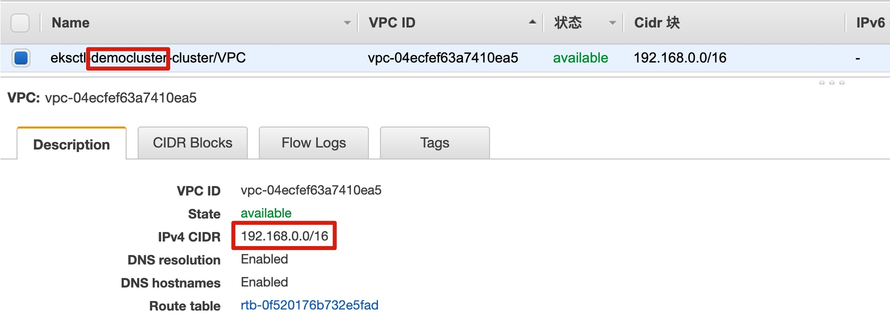
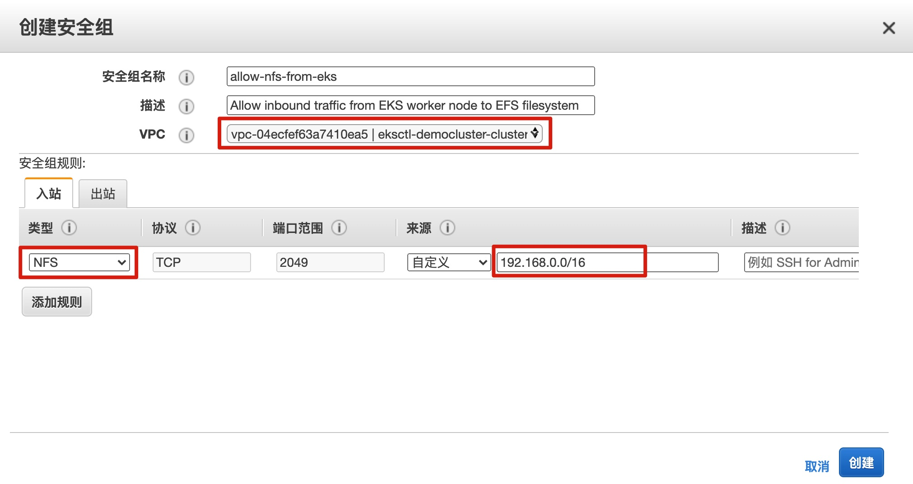
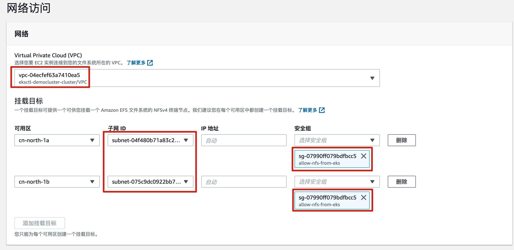
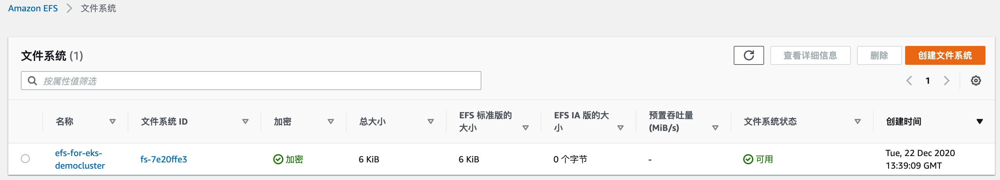

# 步骤5 - 使用 CSI Driver 实现与 Amazon EFS 的集成

当将 Amazon EFS 与 EKS 集群上运行的容器应用相结合时，我们推荐使用 CSI 驱动程序。Amazon 提供的 CSI 驱动程序包括 用于和 Amazon EBS 卷集成的 [aws-ebs-csi-driver](https://github.com/kubernetes-sigs/aws-ebs-csi-driver)，用于和 Amazon EFS 文件系统集成的 [aws-efs-csi-driver](https://github.com/kubernetes-sigs/aws-efs-csi-driver)，以及用于和 Amazon FSx for Lustre 集成的 [aws-fsx-csi-driver](https://github.com/kubernetes-sigs/aws-fsx-csi-driver)。

[Amazon EFS Container Storage Interface (CSI) driver](https://github.com/kubernetes-sigs/aws-efs-csi-driver) 提供了一个 CSI 接口，允许在 AWS 上运行的 Kubernetes 集群，当然也包括 Amazon EKS，对 Amazon EFS 文件系统实现生命周期的管理。

下面我们将介绍如何部署 Amazon EFS CSI 驱动程序到 Amazon EKS 集群，并验证它可以正常工作。


## 部署 Amazon EFS CSI 驱动程序


使用 resources/efs-csi-driver 下面的 yaml 文件进行部署。

进入 efs-csi-driver 目录，部署 Amazon EFS CSI 驱动程序：

```bash
kubectl apply -f aws-efs-csi-driver.yaml
kubectl apply -f aws-efs-csi-driver-node.yaml
```


部署完成后，检查驱动程序正常运行：

```bash
[ec2-user@ip-172-31-19-174 workspace]$ kubectl get po -n kube-system | grep efs-csi-node
efs-csi-node-qbbdw                             3/3     Running   0          58m
```


## 创建 Amazon EFS 文件系统

目前 EFS CSI 驱动程序仅支持 static provisioning。因此需要在使用之前先创建好 Amazon EFS 文件系统，然后才能将文件系统作为 PV 挂载到容器上使用。

先为 EFS 创建一个 安全组，允许来自 EKS 工作节点的 NFS 流量。因此我们先通过 VPC 界面查看并记录 EKS 工作节点的 VPC CIDR 地址段，此地址段将用作 EFS 安全组 入站规则的源地址段。

注意：一定要记录自己的 EKS 集群工作节点所对应的 VPC CIDR 地址段。



进入 EC2 界面中 安全组 页面，点击 **创建安全组**，选择 EKS 集群工作节点所在的 VPC，添加入站规则，为 NFS 类型的流量允许来自 VPC CIDR 段的访问，如下所示。点击创建。




我们通过 AWS Console 创建 EFS 文件系统。进入 EFS 管理界面，点击 **创建文件系统**，然后点击 **自定义** 进入详细配置页面。

在第 1 步 文件系统设置 中填写文件系统名称，其他保持默认选项；

在第 2 步 网络访问 中，

- 选择 EKS 集群工作节点所在的 VPC；
- 在 挂载目标 选项中，子网 ID 选择公共子网；安全组 选项中，删除选中的 default 安全组，选择在上一步创建的安全组，如下所示



其他步骤保持默认，最后点击创建文件系统。

查看 EFS 文件系统已经可用。




## 部署示例应用并使用 EFS 文件系统

使用 resources/efs-csi-driver 下面的 yaml 文件进行部署。

进入 efs-csi-driver 目录，创建 EFS 对应的 storageclass，pv 和 pvc：

```bash
 kubectl apply -f efs-storageclass.yaml
```

注意创建 pv 之前需要修改 efs-pv.yaml 中的 volumeHander 为你自己的 EFS 文件系统 ID。可以在 EFS 界面上查看到，通常以 fs- 开头，如下所示：

```yaml
apiVersion: v1
kind: PersistentVolume
metadata:
  name: efs-pv
spec:
  capacity:
    storage: 5Gi
  volumeMode: Filesystem
  accessModes:
    - ReadWriteMany
  persistentVolumeReclaimPolicy: Retain
  storageClassName: efs-sc
  csi:
    driver: efs.csi.aws.com
    volumeHandle: fs-7e20ffe3
```

创建 pv 和 pvc：

```bash
kubectl apply -f efs-pv.yaml
kubectl apply -f efs-claim.yaml
```


查看创建情况

```bash
[ec2-user@ip-172-31-19-174 workspace]$ kubectl get sc,pv,pvc -o wide
NAME                                        PROVISIONER             RECLAIMPOLICY   VOLUMEBINDINGMODE      ALLOWVOLUMEEXPANSION   AGE
storageclass.storage.k8s.io/efs-sc          efs.csi.aws.com         Delete          Immediate              false                  30s
storageclass.storage.k8s.io/gp2 (default)   kubernetes.io/aws-ebs   Delete          WaitForFirstConsumer   false                  26h

NAME                      CAPACITY   ACCESS MODES   RECLAIM POLICY   STATUS   CLAIM               STORAGECLASS   REASON   AGE   VOLUMEMODE
persistentvolume/efs-pv   5Gi        RWX            Retain           Bound    default/efs-claim   efs-sc                  12s   Filesystem

NAME                              STATUS   VOLUME   CAPACITY   ACCESS MODES   STORAGECLASS   AGE   VOLUMEMODE
persistentvolumeclaim/efs-claim   Bound    efs-pv   5Gi        RWX            efs-sc         6s    Filesystem
```

```bash
[ec2-user@ip-172-31-19-174 workspace]$ kubectl describe pv efs-pv
Name:            efs-pv
Labels:          <none>
Annotations:     pv.kubernetes.io/bound-by-controller: yes
Finalizers:      [kubernetes.io/pv-protection]
StorageClass:    efs-sc
Status:          Bound
Claim:           default/efs-claim
Reclaim Policy:  Retain
Access Modes:    RWX
VolumeMode:      Filesystem
Capacity:        5Gi
Node Affinity:   <none>
Message:         
Source:
    Type:              CSI (a Container Storage Interface (CSI) volume source)
    Driver:            efs.csi.aws.com
    FSType:            
    VolumeHandle:      fs-7e20ffe3
    ReadOnly:          false
    VolumeAttributes:  <none>
Events:                <none>
```


然后部署示例应用

```bash
kubectl apply -f efs-multiplepod.yaml
```


分别查看两个 Pod 数据写入 EFS 文件系统的情况：

```bash
# 分别查看自己写入的数据信息
kubectl exec -ti app1 -- head /data/out1.txt
kubectl exec -ti app2 -- head /data/out2.txt

# 查看对方写入的数据信息
kubectl exec -ti app1 -- head /data/out2.txt
kubectl exec -ti app2 -- head /data/out1.txt
```


示例输出如下，可以看到两个 Pod 挂载了同一个 EFS 文件系统，可以同时读写该文件系统。还可以为 EFS 创建子目录 或者 通过 Access Point 来实现不同的 Pod 只能访问自己的文件系统目录，实现各个应用系统在共享文件系统的基础上实现权限隔离。更多示例可参考 https://github.com/kubernetes-sigs/aws-efs-csi-driver/tree/master/examples/kubernetes

```bash
[ec2-user@ip-172-31-19-174 workspace]$ kubectl exec -ti app1 -- head /data/out1.txt
Tue Dec 22 13:55:07 UTC 2020
Tue Dec 22 13:55:17 UTC 2020
Tue Dec 22 13:55:27 UTC 2020
Tue Dec 22 13:55:37 UTC 2020
Tue Dec 22 13:55:47 UTC 2020
Tue Dec 22 13:55:57 UTC 2020
Tue Dec 22 13:56:07 UTC 2020
Tue Dec 22 13:56:17 UTC 2020
Tue Dec 22 13:56:27 UTC 2020
Tue Dec 22 13:56:37 UTC 2020
[ec2-user@ip-172-31-19-174 workspace]$ kubectl exec -ti app2 -- head /data/out2.txt                                                                                                                                              
Tue Dec 22 13:55:09 UTC 2020
Tue Dec 22 13:55:19 UTC 2020
Tue Dec 22 13:55:29 UTC 2020
Tue Dec 22 13:55:39 UTC 2020
Tue Dec 22 13:55:49 UTC 2020
Tue Dec 22 13:55:59 UTC 2020
Tue Dec 22 13:56:09 UTC 2020
Tue Dec 22 13:56:19 UTC 2020
Tue Dec 22 13:56:29 UTC 2020
Tue Dec 22 13:56:40 UTC 2020
[ec2-user@ip-172-31-19-174 workspace]$ kubectl exec -ti app1 -- head /data/out2.txt                                                                                                                                             
Tue Dec 22 13:55:09 UTC 2020
Tue Dec 22 13:55:19 UTC 2020
Tue Dec 22 13:55:29 UTC 2020
Tue Dec 22 13:55:39 UTC 2020
Tue Dec 22 13:55:49 UTC 2020
Tue Dec 22 13:55:59 UTC 2020
Tue Dec 22 13:56:09 UTC 2020
Tue Dec 22 13:56:19 UTC 2020
Tue Dec 22 13:56:29 UTC 2020
Tue Dec 22 13:56:40 UTC 2020
[ec2-user@ip-172-31-19-174 workspace]$ kubectl exec -ti app2 -- head /data/out1.txt                                                                                                                                               
Tue Dec 22 13:55:07 UTC 2020
Tue Dec 22 13:55:17 UTC 2020
Tue Dec 22 13:55:27 UTC 2020
Tue Dec 22 13:55:37 UTC 2020
Tue Dec 22 13:55:47 UTC 2020
Tue Dec 22 13:55:57 UTC 2020
Tue Dec 22 13:56:07 UTC 2020
Tue Dec 22 13:56:17 UTC 2020
Tue Dec 22 13:56:27 UTC 2020
Tue Dec 22 13:56:37 UTC 2020
```


