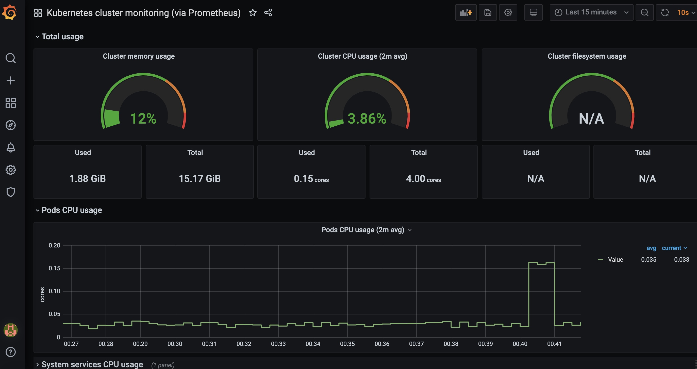
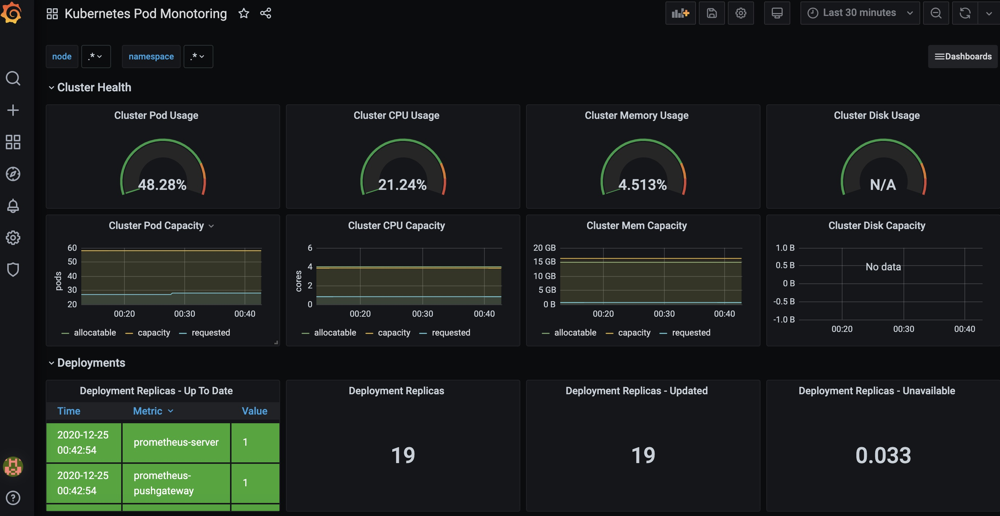
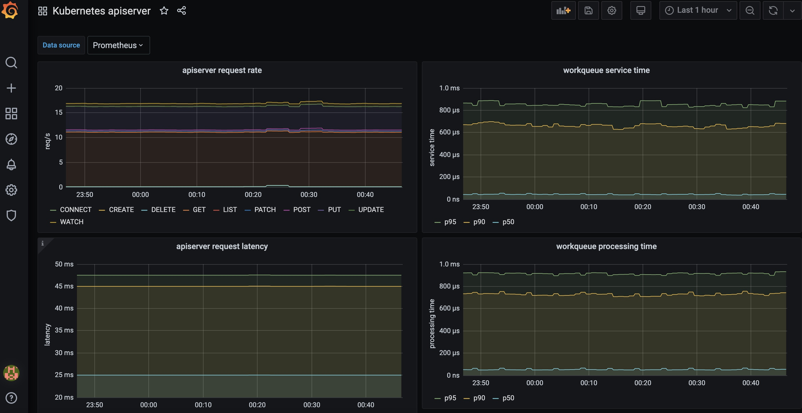

# 步骤6 - 使用 Prometheus 和 Grafana 监控 EKS 集群

在本实验中，我们将安装 Prometheus 和 Grafana 用于监控 EKS 集群的状态。

[Prometheus](https://prometheus.io/) 是最初在 SoundCloud 上构建的开源系统监视和警报工具包。 自2012年成立以来，许多公司和组织都采用了 Prometheus，该项目拥有非常活跃的开发人员和用户社区。 现在，它是一个独立的开源项目，并且独立于任何公司进行维护。 Prometheus 在 2016 年加入了Cloud Native Computing Foundation，这是继Kubernetes 之后的第二个托管项目。

[Grafana](https://grafana.com/) 是开源的可视化和分析软件。 它提供了将时间序列数据库（TSDB）数据转换为精美的图形和可视化效果的工具，可以使用它查询，可视化，浏览指标，并进行告警。


## 安装 Helm

我们使用 Helm 来安装 Prometheus 和 Grafana，[Helm](https://helm.sh/)  是 Kubernetes 的程序包管理器和应用程序管理工具，可将多个 Kubernetes 资源打包到一个称为 Chart 的逻辑部署单元中。

使用 Helm 可以：

- 实现简单和可重复的部署（只需一个命令）
- 使用其他应用程序和服务的特定版本管理应用程序依赖性
- 管理多种部署配置：测试环境，staging，生产环境和其他
- 在应用程序部署期间执行 部署前/部署后 作业
- 更新/回滚并测试应用程序部署

首先安装 Helm

```bash
curl -sSL https://raw.githubusercontent.com/helm/helm/master/scripts/get-helm-3 | bash
```

如果无法连接到 raw.githubusercontent.com 下载和执行安装文件，可使用 resources/helm 下面的 helm-3.sh 脚本。进入 resource/helm 目录，执行脚本安装 Helm。

```bash
chmod +x helm-3.sh
./helm-3.sh
```

安装完成后，可以使用 `helm version --short` 查看 Helm 版本。

```bash
[ec2-user@ip-172-31-19-174 workspace]$ chmod +x helm-3.sh
[ec2-user@ip-172-31-19-174 workspace]$ ./helm-3.sh
Downloading https://get.helm.sh/helm-v3.4.2-linux-amd64.tar.gz
Verifying checksum... Done.
Preparing to install helm into /usr/local/bin
helm installed into /usr/local/bin/helm
[ec2-user@ip-172-31-19-174 workspace]$ helm version --short
v3.4.2+g23dd3af
```


接下来我们通过 Helm 安装 Prometheus 和 Grafana。

首先添加国内镜像源

```bash
helm repo add stable https://burdenbear.github.io/kube-charts-mirror/
```

使用国内镜像源时，不用再通过 webhook 去修改镜像地址，因此我们删除之前部署的 image mutating-webhook。进入 resources/webhook 目录，执行如下命令：

```bash
kubectl delete -f mutating-webhook.yaml
```


## 安装 Prometheus

使用 Helm 国内镜像源安装 Prometheus

```bash
kubectl create namespace prometheus

helm install prometheus stable/prometheus \
    --namespace prometheus \
    --set alertmanager.persistentVolume.storageClass="gp2" \
    --set server.persistentVolume.storageClass="gp2"
```


安装完成后，记录 Helm 输出中的 Prometheus endpoint 信息，类似 `prometheus-server.prometheus.svc.cluster.local`，在后面会使用到。


检查 Prometheus 是否正确安装

```bash
kubectl get all -n prometheus
```

输出示例如下：

```bash
[ec2-user@ip-172-31-19-174 workspace]$ kubectl get all -n prometheus
NAME                                                READY   STATUS    RESTARTS   AGE
pod/prometheus-alertmanager-6b64586d49-2xwrg        2/2     Running   0          6m43s
pod/prometheus-kube-state-metrics-c65b87574-qpcbw   1/1     Running   0          6m43s
pod/prometheus-node-exporter-kg52b                  1/1     Running   0          6m44s
pod/prometheus-node-exporter-ldm8l                  1/1     Running   0          6m43s
pod/prometheus-pushgateway-7d5f5746c7-ch747         1/1     Running   0          6m44s
pod/prometheus-server-f8d46859b-xndbb               2/2     Running   0          6m43s

NAME                                    TYPE        CLUSTER-IP       EXTERNAL-IP   PORT(S)    AGE
service/prometheus-alertmanager         ClusterIP   10.100.190.122   <none>        80/TCP     6m44s
service/prometheus-kube-state-metrics   ClusterIP   10.100.148.164   <none>        8080/TCP   6m44s
service/prometheus-node-exporter        ClusterIP   None             <none>        9100/TCP   6m44s
service/prometheus-pushgateway          ClusterIP   10.100.56.61     <none>        9091/TCP   6m44s
service/prometheus-server               ClusterIP   10.100.34.142    <none>        80/TCP     6m44s

NAME                                      DESIRED   CURRENT   READY   UP-TO-DATE   AVAILABLE   NODE SELECTOR   AGE
daemonset.apps/prometheus-node-exporter   2         2         2       2            2           <none>          6m44s

NAME                                            READY   UP-TO-DATE   AVAILABLE   AGE
deployment.apps/prometheus-alertmanager         1/1     1            1           6m44s
deployment.apps/prometheus-kube-state-metrics   1/1     1            1           6m44s
deployment.apps/prometheus-pushgateway          1/1     1            1           6m44s
deployment.apps/prometheus-server               1/1     1            1           6m44s

NAME                                                      DESIRED   CURRENT   READY   AGE
replicaset.apps/prometheus-alertmanager-6b64586d49        1         1         1       6m44s
replicaset.apps/prometheus-kube-state-metrics-c65b87574   1         1         1       6m44s
replicaset.apps/prometheus-pushgateway-7d5f5746c7         1         1         1       6m44s
replicaset.apps/prometheus-server-f8d46859b               1         1         1       6m44s
```


为 Prometheus 创建 Service 用于访问 Prometheus Server。进入 resources/monitoring 目录，查看 prometheus-service.yaml 文件，注意 chart 要与 helm list 中的版本对应

```bash
[ec2-user@ip-172-31-19-174 workspace]$ helm list -n prometheus
NAME            NAMESPACE       REVISION        UPDATED                                 STATUS          CHART                   APP VERSION
prometheus      prometheus      1               2020-12-24 15:16:08.997266869 +0000 UTC deployed        prometheus-11.12.1      2.20.1  
```

```yaml
apiVersion: v1
kind: Service
metadata:
  labels:
    app: prometheus
    chart: prometheus-11.12.1
    component: server
    heritage: Helm
    release: prometheus
  name: prometheus-nginx
  namespace: prometheus
spec:
  ports:
  - port: 9090
    protocol: TCP
    targetPort: 9090
  selector:
    app: prometheus
    component: server
    release: prometheus
  type: LoadBalancer
```


执行如下命令创建 Service

```bash
kubectl apply -f prometheus-service.yaml
```


使用以下命令查看刚才创建的 Service 对应的 ELB 地址和端口

```bash
 kubectl get svc prometheus-nginx -n prometheus
```

示例输出如下：

```bash
[ec2-user@ip-172-31-19-174 workspace]$ kubectl get svc prometheus-nginx -n prometheus
NAME               TYPE           CLUSTER-IP       EXTERNAL-IP                                                                  PORT(S)          AGE
prometheus-nginx   LoadBalancer   10.100.145.207   a8376d4d4dec148ffb68e93109cec38a-459084430.cn-north-1.elb.amazonaws.com.cn   9090:31097/TCP   8s
```


打开浏览器，通过 ELB DNS 域名和端口访问 Prometheus 界面

在 Status --> Targets 下面可以看到 Prometheus 监控的各种对象和指标


## 安装 Grafana

接下来我们通过 Helm 国内镜像源安装 Grafana。其中，将 datasource  url 指向刚才记录的 Prometheus endpoint，并为 Grafana 创建 LoadBalancer 以便后续访问。

```bash
kubectl create namespace grafana

helm install grafana stable/grafana \
    --namespace grafana \
    --set persistence.storageClassName="gp2" \
    --set adminPassword='EKS!sAWSome' \
    --set datasources."datasources\.yaml".apiVersion=1 \
    --set datasources."datasources\.yaml".datasources[0].name=Prometheus \
    --set datasources."datasources\.yaml".datasources[0].type=prometheus \
    --set datasources."datasources\.yaml".datasources[0].url=http://prometheus-server.prometheus.svc.cluster.local \
    --set datasources."datasources\.yaml".datasources[0].access=proxy \
    --set datasources."datasources\.yaml".datasources[0].isDefault=true \
    --set service.type=LoadBalancer
```


查看部署情况

```bash
kubectl get all -n grafana
```


输出示例

```bash
[ec2-user@ip-172-31-19-174 workspace]$ kubectl get all -n grafana
NAME                           READY   STATUS    RESTARTS   AGE
pod/grafana-7d9f588cb4-ghjqr   1/1     Running   0          98s

NAME              TYPE           CLUSTER-IP       EXTERNAL-IP                                                                   PORT(S)        AGE
service/grafana   LoadBalancer   10.100.218.240   afc845443b0fa4cd2bdf0cb49f31d3cf-1788689401.cn-north-1.elb.amazonaws.com.cn   80:31209/TCP   98s

NAME                      READY   UP-TO-DATE   AVAILABLE   AGE
deployment.apps/grafana   1/1     1            1           98s

NAME                                 DESIRED   CURRENT   READY   AGE
replicaset.apps/grafana-7d9f588cb4   1         1         1       98s
```


通过上面输出显示的 ELB 地址访问 Grafana。

用户名 admin，密码通过以下命令获取：

```bash
kubectl get secret --namespace grafana grafana -o jsonpath="{.data.admin-password}" | base64 --decode ; echo
```


登录 Grafana 后，创建监控面板

创建集群监控面板

- 左侧面板点击' + '，选择' Import '
- Grafana.com Dashboard下输入 3119，点击 load
- Prometheus data source 下拉框中选择 prometheus
- 点击' Import '




创建 Pods 监控面板

- 左侧面板点击' + '，选择' Import '
- Grafana.com Dashboard下输 6417，点击 load
- 输入Kubernetes Pods Monitoring 作为 Dashboard 名称
- 点击 change uid，设置uid
- Prometheus data source下拉框中选择 prometheus
- 点击' Import '




创建 API Server 监控面板

- 左侧面板点击' + '，选择' Import '
- Grafana.com Dashboard下输 12006，点击 load
- 点击 change uid，设置 uid
- 点击' Import '

